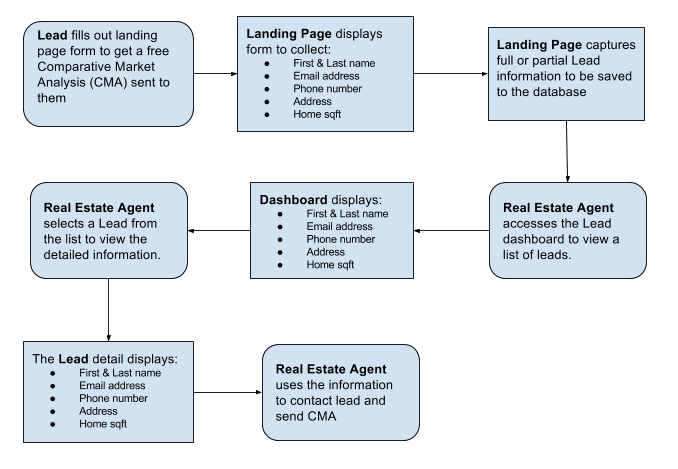

BoldLeads Full Stack Interview Exercise
=======================================

Problem
-------------
You are tasked with building a lead capturing system that is part of an overall lead generation system for Real Estate Agents. The company marketing team has developed a campaign that will send to your part of the system a continual flow of leads. The leads are coming to get a free Comparative Market Analysis (CMA) for their home. For your part you need to build the landing page to collect the lead information, database to store the lead information and lead dashboard to view master/detail lead information. The overall flow of the system is as follows:

Solution
-------------
To address this problem you need to create the following:
* Landing page with a simple form to collect the following:
  * First & Last name
  * Email Address
  * Phone number
  * Address
  * Home square footage
* Dashboard listing page to all view leads. The listing page should list leads in alphabetical order displaying:
  * First & Last name
  * Email Address
  * Date lead was saved to the database
* Detail page to view a individual lead. With the following information:
  * First & Last name
  * Email Address
  * Phone number
  * Address
  * Home square footage

Things to consider when building the solution.
* Leads may not fill out everything in the Landing page or they may leave the page before hitting submit. We want to be able to able to capture anything they may enter into the form without them submitting the form (hint: Ajax may help here).
* Making the landing page as simple and visually appealing will increase the likelihood that the lead will complete the entire form, hence creating a better lead.
* We do not expect you to spend more than 4 hours working on this solution. So please do not stress out if is not perfect or you feel more can be done. Just add notes in your git commits on how you would add or do more if you had more time. The expectations are for a basic working solution of 3 pages (landing page, lead dashboard listing page, lead detail page) and database.

Your solution should be created in a https://github.com/ repository. Your git log should contain several commits showing your development workflow/progress, we want to see your individual commits as you build the solution.

You should also create a README with a description of the project and setup instructions. We also expect to be able to run a basic set of tests so we can validate the solution works, so please make sure you explain in your README how to run the tests.

You can create your solution using any modern web development framework, language, and database, but extra points for doing it in PHP (we are a LAMP shop).

If you have any questions please email carlos@boldleads.com

Submission
-------------
Please email a link to your repository to carlos@boldleads.com
